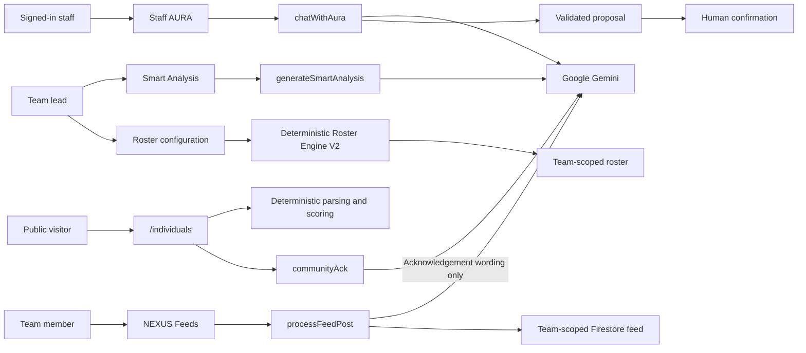

# NEXUS: Smart Operations Dashboard v2.12.3

     

**NEXUS** (formerly IDC App) is a clinician-led progressive web application for team operations, workload tracking, staff wellbeing, rostering and community health screening. It uses a multi-team Firebase data model so each department and institution has its own membership, settings and operational records.

> **Master the Grind · Protect the Pulse · Build the Future**

## Current status

| Item | Status | Evidence and meaning |
|---|---|---|
| Application version | `IMPLEMENTED` — **v2.12.3** | `package.json` is the version source; `src/version.js` supplies the label rendered in the app. |
| Deployment | `IMPLEMENTED` | A push to `main` runs build, test and lint, then deploys Cloud Functions, Firestore Rules, indexes and Firebase Hosting. |
| AU18 response parser | `IMPLEMENTED` and `VERIFIED` under **Unreleased** | The staff AURA client and Cloud Functions share `functions/responseParser.cjs`. This code was deployed after v2.12.3 without changing the displayed version. |
| Community functional measures | `PROPOSED` | No grip-strength or sit-to-stand feature has been built. Decisions `CD17`–`CD25` remain with the owner; `CD17`, `CD18`, `CD19` and `CD25` block implementation. |
| Open work | `OPEN` / `OWNER DECISION` | The live queues are in `AURA-TODO.md`, `ROSTER_TODO.md` and `COMMUNITY_TODO.md`. README summaries never close those rows. |

The deployed application therefore reports **v2.12.3**, while current `main` also contains the Unreleased AU18 parser fix and documentation corrections. See [`CHANGELOG.md`](CHANGELOG.md) for the authoritative release record.

## Product boundaries

NEXUS contains several connected surfaces with different users, data and assurance needs. They must be reviewed separately.

| Surface | Access | AI involvement | What current code does |
|---|---|---|---|
| **Roster Engine V2** | Signed-in team members; lead-only generation and configuration writes | **None** | A deterministic constraint solver uses team rules, staff attributes and availability. The same inputs produce the same result. Coverage belongs to the roster surface. |
| **Staff AURA Assistant** | Signed-in staff | **Google Gemini** via `chatWithAura` | Supports wellbeing conversation, document drafting and proposed workload entries. A proposed write is validated by application code and requires human confirmation. AURA does not generate or alter rosters. |
| **NEXUS Feeds** | Signed-in members of the selected team | **Google Gemini** screens and categorises posts | Posts are written through `processFeedPost` after server-side membership checks. Comments use a separate direct-write path with client and Firestore-rule checks for NRIC/FIN-shaped tokens. |
| **Smart Workload / Intelligence** | Team data; Smart Analysis generation is lead-only | **Google Gemini** for generated analysis | Sends seniority bands rather than exact grades. Current payloads can still contain identifiable staff names, titles and workload information. |
| **Public `/individuals` screening** | Public; no staff account required | **Google Gemini** only for optional acknowledgement wording through `communityAck` | Screening questions, parsing, risk scoring and routing are separate from staff AURA. The Gemini acknowledgement does not calculate or control the result. |

A prompt instruction to Gemini is a request to a non-deterministic model. It becomes a technical guarantee only when current application code validates, constrains or rejects the relevant behaviour.

## Implemented capabilities

### Roster Engine V2

- Configurable duties, grade bands and floors, skills, FTE, unavailability, hours ceilings, consecutive-day limits, quotas, forbidden pairs, weekly rotation and named standby assignments.
- Department and personal-week views.
- PDF, Excel, CSV and ICS exports.
- Person-to-person coverage requests and acceptance on the roster surface.

### Staff AURA Assistant

- Wellbeing conversations and check-in proposals.
- Operational document drafting with `.docx` export.
- Natural-language workload proposals that are checked against application allowlists and types before a person confirms the write.
- Shared Gemini JSON parsing on the client and server (`AU18`).

### NEXUS Feeds

- Team-scoped posts, comments, filters, deep links and lightbox reading.
- Server-side membership verification for post creation.
- Gemini-assisted post screening and categorisation, plus a deterministic NRIC/FIN-shaped-token check.

### Smart Workload / Intelligence

- Workload dashboards and historical reports.
- Lead-only generated analysis and archived reports.
- Seniority-band transformation before Gemini; exact grades are excluded by tests, while names, titles and workload values may still be sent.

### Public health screening

- Separate conversational and conventional-form pathways under `/individuals`.
- Deterministic parsing, scoring, result routing and printable handover slip.
- Four interface languages: English, Malay, Chinese and Tamil. Native-speaker review remains an owner-governance task where recorded in `COMMUNITY_TODO.md`.
- A separate, constrained `communityAck` endpoint for brief acknowledgement wording.

## Claims this repository does not establish

- It does not establish that NEXUS is anonymous, de-identified or PDPA-compliant.
- It does not establish that Gemini receives no personal information. Smart Analysis can send names, titles and workload information; each AI endpoint has its own payload.
- It does not establish that a model follows a prompt on every run. Read code controls and verification evidence separately from prompt wording.
- It does not establish clinical validation of the public scoring model. The public pathway is a routing aid and is not a diagnosis.
- It does not establish that Demo Mode is a separate Firebase environment. Most demo data is local, but the application is configured to the production Firebase project and some signed-in actions can call production services.

## Quick start

### Prerequisites

- Node.js **24** for parity with the Cloud Functions runtime.
- npm.
- Firebase CLI only for emulator or deployment work.

### Install and run

```bash
npm install
npm run dev
```

Vite prints the local URL. The repository contains its Firebase web configuration, so a local build can contact the configured Firebase project. Use test accounts and deliberate inputs; do not assume localhost or Demo Mode creates a separate backend.

### Verification gates

Run the same three gates used before deployment, in this order:

```bash
npm run build
npm test
npm run lint
```

Build runs first because bundle-level tests inspect the generated `dist/` artefact. Do not report a gate as passing unless its command completes successfully.

### Backend dependencies

Cloud Functions have their own lockfile and runtime:

```bash
cd functions
npm ci
```

`GEMINI_API_KEY` is a deployed Cloud Functions secret. App Check rollout also uses `VITE_APPCHECK_SITE_KEY` and `ENFORCE_APP_CHECK`; `RATE_LIMIT_SALT` is a repository secret. Follow the ordered rollout in [`COMMUNITY_TODO.md`](COMMUNITY_TODO.md) before enabling enforcement.

## Technical architecture and repository map

The frontend is a React/Vite PWA. Firebase provides Authentication, Firestore, Cloud Functions, Cloud Messaging, Storage and Hosting. Team-scoped data lives below `teams/{teamId}`; membership documents and endpoint checks are part of the authorization model. The public screening uses separate non-team collections and endpoints.

### Tech Stack
* **Frontend:** React (Vite build system)
* **Styling:** Tailwind CSS (utilising `animate-in` plugins and dynamic `dvh` math for mobile responsiveness)
* **Icons:** `lucide-react`
* **Charts:** `recharts`
* **Backend / Auth:** Firebase (Firestore, Authentication, Cloud Functions)
* **Document Generation:** `docx`

### Working on the repository

Use a feature branch and inspect the relevant ledger before changing a governed surface. The mandatory local gates are `npm run build`, `npm test` and `npm run lint`, in that order. A push to `main` starts `.github/workflows/deploy.yml`; after the gates pass, that workflow deploys Functions, Firestore Rules, indexes and Hosting.

The frontend and Functions have separate dependency manifests. Run `npm install` at the repository root for frontend development and tests; run `npm ci` inside `functions/` when working on or deploying the backend.

### Repository Structure
```text
nexus/
|-- .github/workflows/
|   |-- deploy.yml                 # CI: build, test, lint; deploys functions, rules, indexes, hosting
|   |-- tag-release.yml            # Cuts the vX.Y.Z tag on workflow_dispatch
|   |-- verify-aura.yml            # Manually runs the live AURA verification turns
|-- docs/                          # Info card, walkthrough deck, design prompts, translation workbook
|-- scripts/                       # Admin-SDK runbooks and the rules emulator suite (see below)
|   |-- firestore-rules-verify.mjs # Emulator checks against firestore.rules (149 as of 2026-09-03)
|   |-- migrate-to-teams.cjs       # The one-time v2.0.0 cutover — executed 2026-08-23
|   |-- bootstrap-config.cjs       # Seeds config/domains and config/superAdmins
|   |-- add-pending-member.cjs     # Roster a colleague who has not registered yet
|   |-- roster-stress.mjs          # Engine stress probes (with roster-scaling.mjs)
|-- functions/                     # Cloud Functions (Gemini calls, membership, rollups)
|   |-- index.js                   # All callables and scheduled jobs
|   |-- teamMembership.js          # inviteMember and the domain gate
|   |-- teamApproval.js            # Lead requests and super-admin approval
|   |-- communityAck.js            # The public screening's acknowledgement call
|   |-- rateLimit.js               # Public and staff AI-call ceilings
|   |-- responseParser.cjs         # Shared Gemini JSON parser (server and staff client)
|   |-- modelQuota.cjs             # Quota-aware model demotion (AU30)
|   |-- guardrails.cjs             # The prompt-carried guardrail preamble
|   |-- personas.cjs               # Persona texts, verbatim
|   |-- attachmentRules.cjs        # What the attachment path accepts, and the audit log
|   |-- insights.cjs               # Community rollup
|   |-- retention.cjs              # Retention windows
|   |-- package.json               # Backend dependencies (versioned separately)
|-- public/                        # Static assets and PWA manifest
|   |-- firebase-messaging-sw.js   # Service worker for push notifications
|   |-- manifest.json              # Progressive Web App configuration
|   |-- logo.png                   # Live department branding
|   |-- nexus.png                  # Sandbox branding
|   |-- logos/                     # Institution logos
|-- src/                           # React Frontend Source
|   |-- version.js                 # THE ONE PLACE the app learns its version (from package.json)
|   |-- components/                # Reusable React UI components
|   |   |-- AccessGate.jsx         # Sign-in and membership gate
|   |   |-- AdminPanel.jsx         # Executive overview and audit logs
|   |   |-- AdminWellbeingPanel.jsx
|   |   |-- AppGuide.jsx           # Application manual and onboarding
|   |   |-- AuraGreeting.jsx       # Contextual floating smart quote widget
|   |   |-- AuraInfoCard.jsx       # Renders docs/AURA-CHATBOT-INFO-CARD.md at /aura-info
|   |   |-- AuraPulseBot.jsx       # AURA staff assistant chat interface
|   |   |-- Aura.hooks.js          # Chat hooks
|   |   |-- CommunityInsightsPanel.jsx
|   |   |-- ConfirmationModal.jsx  # Secure action validation dialogs
|   |   |-- CoverageWatcher.jsx    # Listens for coverage requests addressed to you
|   |   |-- FeedbackWidget.jsx     # Ghost event-driven bug reporter
|   |   |-- FeedsView.jsx          # Digital watercooler and posts
|   |   |-- LeadRequestsPanel.jsx  # Super-admin approval of lead requests
|   |   |-- PostLightbox.jsx       # Immersive post expansion UI
|   |   |-- ProfileView.jsx        # User management and authentication
|   |   |-- ResponsiveLayout.jsx   # Core responsive shell (Mobile/Desktop)
|   |   |-- RosterView.jsx         # The roster: calendar, Department / My week, coverage
|   |   |-- RosterDemoWizardTables.jsx # Configure — the staff and task tables
|   |   |-- RosterExportMenu.jsx   # One Export control: PDF, Excel, CSV, ICS
|   |   |-- WizardStep.jsx         # Configure step shell
|   |   |-- StaffLoadEditor.jsx
|   |   |-- SmartAnalysis.jsx      # Year-end wellbeing analysis (lead only)
|   |   |-- SmartReportView.jsx    # Renders an archived analysis
|   |   |-- TeamMembersPanel.jsx   # A lead invites, removes, sets profession and grade
|   |   |-- TeamSwitcher.jsx       # Which team, for a member of more than one
|   |   |-- WelcomeScreen.jsx      # Sign-in
|   |   |-- WellbeingView.jsx      # Pulse and social battery tracking
|   |   |-- PathwaySelection.jsx   # PUBLIC /individuals — chat or form
|   |   |-- LanguageGate.jsx       # PUBLIC language choice (en, ms, zh, ta)
|   |   |-- AuraChat.jsx           # PUBLIC health screening (conversational)
|   |   |-- ConventionalForm.jsx   # PUBLIC health screening (form pathway)
|   |   |-- ResultPage.jsx         # PUBLIC result, CTA tiers and the printable slip
|   |   |-- HandoverSlip.jsx       # PUBLIC printable slip
|   |-- config/
|   |   |-- personas.js            # AURA behaviour models
|   |-- context/
|   |   |-- NexusContext.jsx       # Theme, demo mode, auth state
|   |   |-- TeamContext.jsx        # WHICH TEAM — membership, isLead, the switcher
|   |   |-- TeamGate.jsx           # Nothing team-scoped renders without a team
|   |-- data/
|   |   |-- mockData.js            # Marvel superhero simulation dataset and the demo shapes
|   |   |-- mohAlliedHealth.js     # MOH's 28 professions, plus the roles MOH does not name
|   |   |-- screeningChips.js      # PUBLIC screening answer chips
|   |   |-- slipFlagLines.js       # PUBLIC slip flag copy
|   |-- hooks/
|   |   |-- useTeamGrades.js       # Pay grades, lead only, one read per member
|   |   |-- useMemberGrade.js      # Your own grade
|   |   |-- useDomainAllowlist.js  # config/domains, with a `configured` flag
|   |-- utils/
|   |   |-- rosterEngineV2.js      # THE ROSTER ENGINE — deterministic, no AI
|   |   |-- rosterWizard.js        # Configure ⇄ engine mapping and validation
|   |   |-- rosterSettings.js      # teams/{id}/settings/roster — survives a reload
|   |   |-- rosterGrid.js          # Calendar grid model
|   |   |-- rosterPersonView.js    # My week
|   |   |-- rosterCoverage.js      # Coverage requests
|   |   |-- rosterCategories.js    # Task categories and colours
|   |   |-- rosterPdf.js           # PDF wall calendar export
|   |   |-- rosterXlsx.js          # Excel workbook export (with zipWriter.js)
|   |   |-- memberProfile.js       # onlyTasks, shortName, grade parsing
|   |   |-- auraEngine.js          # Roster primitives, ICS/CSV export, swap planning
|   |   |-- dataEntryGuard.js      # What the model is allowed to write (pure)
|   |   |-- clinicalFlags.js       # Shared clinical parsers for both public pathways
|   |   |-- clinicalParse.js       # PUBLIC free-text parsing (AC5)
|   |   |-- scoring.js             # PUBLIC risk scoring
|   |   |-- language.js            # PUBLIC translations (en, ms, zh, ta)
|   |   |-- accessPolicy.js        # Domain allowlist defaults
|   |   |-- legacyBridge.js        # Salted digests in place of the deleted directory (AN14)
|   |   |-- teamPaths.js           # Every Firestore path, derived from teamId
|   |   |-- contrast.js            # WCAG contrast, pinned by contrast.test.js
|   |   |-- index.js               # Shared utilities
|   |-- App.jsx                    # Main application router and shell
|   |-- firebase.js                # Firebase client initialisation
|   |-- main.jsx                   # React DOM entry point
|   |-- index.css                  # Global styles
|   |-- style.css                  # Component-specific overrides
|-- firestore.rules                # THE authorization boundary — read before changing
|-- firestore.indexes.json         # Deployed with the rules
|-- firebase.json                  # Hosting (with cache headers), functions, firestore
|-- package.json                   # THE app version, dependencies, scripts
|-- vitest.config.js               # The suite includes src/, functions/ and scripts/
|-- tailwind.config.js             # Tailwind CSS styling configuration
|-- cors.json                      # Cross-Origin Resource Sharing rules
```

### System flows



The roster and public score paths do not call Gemini. Staff AURA, Feeds, Smart Analysis and the public acknowledgement endpoint each have separate inputs and controls.

### Development guardrails

1. Keep the roster deterministic. Changes to `rosterEngineV2.js` require deterministic fixtures and invariant checks; Gemini must not enter the roster path.
2. Treat `firestore.rules` and callable authorization checks as security boundaries. Client-side visibility and domain checks do not grant access.
3. Keep team paths derived from `teamId` and verify membership on Admin SDK functions, because Admin SDK calls bypass Firestore Rules.
4. Validate Gemini output in application code wherever behaviour must be guaranteed. Prompt text alone is not enforcement.
5. Preserve human confirmation for AURA-proposed writes.
6. Update the relevant ledger without renumbering or reusing remediation identifiers.

***

## Security, Access and Data Governance

**THE INTERNAL STAFF UI REQUIRES AUTHENTICATION AND TEAM MEMBERSHIP. `/individuals` IS A SEPARATE PUBLIC PATHWAY.**
NEXUS is an operational and workload management tool. It is not a clinical system and is not a fully integrated hospital system managed by Synapxe. Firebase Authentication identifies staff, Firestore rules gate team-scoped stored data by membership, and callable functions apply their own endpoint-specific checks. The public health-screening pathway does not use the internal staff assistant.

### Supported versions

The current application version is **2.12.3**. [`SECURITY.md`](SECURITY.md) is the authority for support and vulnerability-reporting policy; `package.json` is the authority for the application version. Release changes belong in [`CHANGELOG.md`](CHANGELOG.md), avoiding a second release table that can drift.

### Access and data controls

- **Authentication and membership:** Firebase Authentication identifies staff. Firestore Rules check membership against `teams/{teamId}/members/{uid}` for team-scoped reads and writes. A registered account without membership cannot read team data.
- **Roles:** lead authority is stored on the team membership document and checked again inside privileged Cloud Functions that use the Admin SDK. Client-side role checks are presentation controls only.
- **Registration domain:** the institution-domain check is an onboarding aid. It can be bypassed through the Firebase Auth SDK and is not the authorization boundary.
- **Feeds:** post creation runs through `processFeedPost`, which re-checks authentication and membership before writing. Gemini screens the post, while a deterministic check separately rejects NRIC/FIN-shaped tokens. Comments bypass Gemini and have narrower client and Firestore-rule checks. These controls do not establish general privacy screening or PDPA compliance.
- **Attachments:** the staff callable limits count, declared MIME type and encoded size and records pass-through metadata. The client does not currently send attachments, and the server does not inspect file content. The policy decision remains `AU17`.
- **Public screening:** `/individuals` is intentionally unauthenticated. Assessment records are not readable by clients. The separate `communityAck` endpoint is rate-limited; App Check code is present but enforcement remains pending the ordered `CP7` console rollout.
- **Demo Mode:** mock data and write guards reduce demo-side effects, but Demo Mode is not a separate Firebase project or database boundary.

NEXUS has no EMR integration. Do not enter or upload patient-identifiable information; use placeholders such as `[Patient]` and `[Clinician]`.

### Generative AI transparency

[`docs/AURA-CHATBOT-INFO-CARD.md`](docs/AURA-CHATBOT-INFO-CARD.md) is the owner-approved disclosure for the staff assistant, public conversational screening and year-end analysis. The application serves it at `/aura-info`, links to it from the relevant chat surfaces and records its approval history. It is structured after the voluntary IMDA *Transparency Guidelines for Generative AI Chatbots*. This is a transparency baseline, not a certification or a general compliance claim.

The roster engine is outside the card because it contains no model. NEXUS Feeds uses Gemini for post screening and categorisation and is described separately in this README and the governance ledgers. A dedicated public support mailbox remains an `OWNER DECISION` follow-up in `AURA-TODO.md`.

### Known limitations

- **AURA writes require confirmation.** Staff AURA can propose a workload entry; application code validates the proposal and a person must confirm it before the client writes. Model wording alone does not execute a write.
- **Coverage acceptance does not re-run every roster constraint.** Replacing the requester can create a consecutive-working-day issue for the accepting colleague. The requester is also not notified of the result (`Q3`).
- **Eligibility has one skill slot.** A task cannot currently require both registration status and a separate competency (`Q12`).
- **On-call is not modelled.** A named standby exists, but call-in and post-call-rest semantics do not.
- **Public App Check is not yet enforced.** Rate limits are active; the remaining console rollout is recorded under `CP7`.
- **Gemini output remains non-deterministic.** The repository distinguishes prompt-carried requests from code-enforced controls in `AURA-GUARDRAILS.md` and the AURA ledger.

***

## The paper trail

The live record lives beside the code. [`IDS.md`](IDS.md) is the legend for every id series
(`P`, `Q`, `D`, `CP`, `CD`, `AU`, `AC`, `AN`, …) used across these files. The convention: a
**TODO ledger** is the live status and a row is `DONE` only with pasted evidence; the
**changelog** is the record of what shipped.

| Document | What it is |
|---|---|
| [`CHANGELOG.md`](CHANGELOG.md) | The authoritative release record, Keep-a-Changelog format, newest first |
| [`SECURITY.md`](SECURITY.md) | Supported versions, how to report a vulnerability, the IMDA transparency pointer |
| [`IDS.md`](IDS.md) | Which prefix means what, and the rule that a new series adds a row |
| [`ROSTER_TODO.md`](ROSTER_TODO.md) | The roster engine: the remediation ledger, the current queue, the expressiveness ledger, and the owner's open `Q`n decisions |
| [`AURA-TODO.md`](AURA-TODO.md) · [`AURA-CHANGELOG.md`](AURA-CHANGELOG.md) | AURA, the assistant: the ledger — 65 findings, 55 closed with evidence, 10 open (all owner decisions) — and the engine-tier history |
| [`AURA-GUARDRAILS.md`](AURA-GUARDRAILS.md) | The owner's sixteen working rules, verbatim, with the honest conformance table — what is CODE, what is only asked of a model |
| [`AURA-VERIFICATION-TURNS.md`](AURA-VERIFICATION-TURNS.md) · `docs/P8.8-owner-read-2026-09-05.md` | The 20 real turns that gate any claim that AURA *follows* the guardrails, and the drafted read from three live runs on 2026-09-05 — owner verdicts pending |
| [`docs/AURA-CHATBOT-INFO-CARD.md`](docs/AURA-CHATBOT-INFO-CARD.md) | The IMDA-aligned chatbot info card for AURA's generative surfaces — owner-approved, served in-app at `/aura-info` |
| [`COMMUNITY_TODO.md`](COMMUNITY_TODO.md) · [`COMMUNITY_CHANGELOG.md`](COMMUNITY_CHANGELOG.md) | The public portal (`/individuals`): the `CP`n defect / `CD`n decision ledger and the surface's changelog |
| [`docs/FUNCTIONAL-MEASURES-ADDIE.md`](docs/FUNCTIONAL-MEASURES-ADDIE.md) | `PROPOSED` grip-strength and sit-to-stand plan for the public portal; nothing built, with `CD17`–`CD25` awaiting owner decisions |
| [`TRANSLATION-BRIEF.md`](TRANSLATION-BRIEF.md) | The `CD10` brief: what needs translating into ms/zh/ta, and why machine-translating clinical advice is dangerous |
| `docs/NEXUS-roster-walkthrough.pptx` · `docs/CLAUDE-DESIGN-PROMPTS.md` | The AHP walkthrough deck (v2.1.0 screens; the roster toolbar has since changed) and the prompt pack for restyling it |
| `docs/CD13-translation-review.xlsx` | The native-speaker review workbook for the 19 machine-translated strings |
| [`docs/NATIVE-APP-PORTING.md`](docs/NATIVE-APP-PORTING.md) | The workflow for shipping the staff app to the App Store and Google Play with Capacitor — phases, gates, the four seams that must change, and the owner's decisions. Not started |

**The audit history is in git, not in the tree.** The post-mortems, the QC audits, the two
handoffs, the go-live gate and the two executed runbooks were dated snapshots whose findings
were never edited once fixed; by v2.12 every one of them described a repository that no
longer existed, and they were removed on 2026-09-06. They are one command away, with their
last status banners, at the tag **`docs-archive-2026-09-06`** — for example:

```bash
git show docs-archive-2026-09-06:ROSTER_POSTMORTEM.md
```

Every finding id cited in `CHANGELOG.md` or in a source comment (`A`–`E`, `A-RC`, `M`, `D`,
`AU`/`AC`/`AN`) resolves there.

## Demo Mode and smoke testing

Demo Mode supplies a Marvel-themed mock team for stakeholder walkthroughs. It is not a separate backend, so use test accounts and avoid real personal or patient information. Do not submit a Feeds post merely to test the interface: a signed-in team member's demo-tagged post is still stored in that team's production feed collection.

Use these focused checks after a deployment:

1. **Roster coverage:** use two signed-in live test users. One requests cover from their shift; the addressed colleague should see the inline roster card and be able to accept or decline. This path is unavailable in Demo Mode.
2. **AURA data entry:** tell staff AURA, “I saw 145 patients in June.” It should show a `DATA_ENTRY` confirmation card. In Demo Mode, confirming should state that nothing was saved.
3. **Document export:** ask staff AURA to draft a one-page SOP and verify that `.docx` export completes.
4. **Smart Analysis:** in Demo Mode, generation should return the local Marvel-themed brief without calling the live analysis endpoint.

***

## Releases and current work

[`CHANGELOG.md`](CHANGELOG.md) is the authoritative release history. The current version is **v2.12.3**; current `main` also contains an Unreleased, deployed AU18 parser fix and documentation corrections.

The next work is governed by the live ledgers:

- [`AURA-TODO.md`](AURA-TODO.md): staff AURA, public chat and intelligence findings. The engineering queue is currently empty; ten items require owner decisions.
- [`ROSTER_TODO.md`](ROSTER_TODO.md): deterministic roster queue and `Q`-series owner decisions. Current gaps include single-cell editing, half-day sessions, registration as an eligibility axis, supervision pairing and on-call semantics.
- [`COMMUNITY_TODO.md`](COMMUNITY_TODO.md): four open engineering items, App Check console work, translation review and seventeen owner decisions.
- [`docs/FUNCTIONAL-MEASURES-ADDIE.md`](docs/FUNCTIONAL-MEASURES-ADDIE.md): a `PROPOSED` plan only. No implementation is authorised while its blocking decisions remain open.

***

## Project Lead and License

* **Muhammad Alif** : *Lead and Senior Clinical Exercise Physiologist*
* *Concept, Architecture and Development Phase (2026)*

**Copyright 2026 Muhammad Alif. All Rights Reserved.** This repository is provided for portfolio and demonstration purposes only. You may not copy, reproduce, distribute, publish, display, perform, modify, create derivative works, transmit, or in any way exploit any such content, nor may you distribute any part of this content over any network, sell or offer it for sale, or use such content to construct any kind of database.
